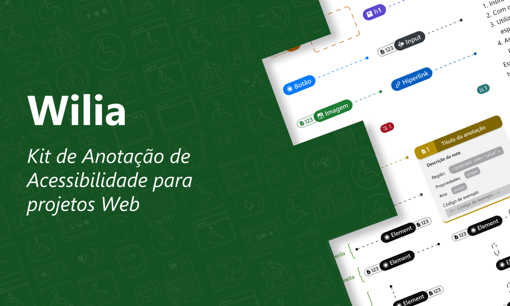

# Wilia: Kit de Anotações de Acessibilidade para Web

**Wilia (um acrônimo para *Web Accessility Annotation Kit*) é um UI Kit para Figma focado em especificações de acessibilidade para tecnologias assistivas.**

---

## Esse projeto é uma ponte entre Design e Acessibilidade

O Wilia nasceu de uma observação comum em times de produtos digitais: um designer cria uma interface incrível, um desenvolvedor a implementa com perfeição técnica, mas, no final, algo crucial se perde no caminho. Uma pessoa que usa leitor de tela não consegue preencher o formulário, ou um usuário que navega pelo teclado não alcança o botão principal.

Essa lacuna acontece porque a conversa sobre acessibilidade nem sempre ocorre. Faltam ferramentas e uma linguagem comum para que o designer possa dizer ao desenvolvedor: *"Este ícone precisa ser anunciado como 'Fechar'"*, ou *"A ordem de foco nesta seção deve ser esta"*.

**O Wilia existe para ser essa conversa.** Ele nasceu para traduzir os requisitos de acessibilidade em especificações visuais, claras e diretas, dentro do Figma.

A missão do kit é simples: **tornar a especificação de acessibilidade uma parte natural e intuitiva do fluxo de trabalho**, e não uma preocupação tardia.

## O que você pode documentar com o Wilia?

O kit oferece um conjunto de "etiquetas" e "notas" visuais que você pode usar para anotar seus designs. Com elas, você pode especificar:

* **Estrutura e Semântica:** A hierarquia de Cabeçalhos (`h1`-`h6`), as Regiões e *landmarks* da página (`header`, `main`, etc.).
* **Interatividade:** A função de Botões, o destino de Hiperlinks e todos os detalhes de Campos de Entrada de formulários.
* **Conteúdo:** O propósito de Imagens e seus textos alternativos.
* **Comportamento:** A Ordem de Foco para navegação por teclado e a Ordem de Leitura para leitores de tela.
* **Casos Especiais:** Usar a Anotação Geral para instruções extras ou instruir o que um leitor de tela deve Ignorar (elementos decorativos).

## Como Usar o Wilia (O Componente "Multiespecificação")

O *Wilia* foi projetado para ser uma ferramenta de produtividade. Em vez de procurar por componentes individuais na biblioteca, você usará principalmente o componente **`Multiespecificação`**.

Este componente único agrupa todas as especificações em um só lugar, permitindo que você o configure rapidamente usando as *variants* do Figma.

1.  **Acesse o Kit** na [Comunidade Figma](https://www.figma.com/community/file/1571609699997548870).
2.  **Copie** o componente `Multiespecificação` (ou duplique o kit para usá-lo como biblioteca).
3.  **Cole** o componente em seu design.
4.  Com o componente selecionado, vá ao **painel de Design** (à direita).
5.  Use as **propriedades (variants)** para selecionar o tipo de especificação que você precisa (ex: "Tipo = Cabeçalho", "Tipo = Botão", etc.).
6.  Preencha as propriedades da anotação (como nível do heading, atributos ARIA, etc.).

> **Nota Importante:** Caso o componente apresente algum comportamento inesperado ou bug visual, recomenda-se redefinir a instância. Selecione o componente, clique no menu "•••" (Mais opções) no painel de Design e escolha a opção "Redefinir instância" (Reset instance).

## O que você encontra neste repositório?

Este repositório contém todo o material acadêmico relacionado ao projeto:

* `/academico/`: Pasta contendo os arquivos-fonte do TCC (arquivos `.tex`, `.bib`, imagens) e a versão final em `.pdf`.
* `README.md`: Este arquivo de apresentação.
* `LICENSE`: A licença do projeto.
* `/images/`: Pasta contendo imagens do Willia.

## Mentores do Projeto (Referências)

A sabedoria do *Wilia* é construída sobre os padrões que guiam a web acessível:
* World Wide Web Consortium (W3C): WCAG 2.2 e WAI-ARIA Authoring Practices Guide (APG).
* WebAIM (Web Accessibility in Mind): Incluindo o relatório "The WebAIM Million".
* Mozilla (MDN Web Docs): Guias práticos de implementação de acessibilidade.
* Movimento Web para Todos (MWPT): A principal iniciativa sobre o tema no Brasil.

<!--
## Licença

Este projeto está licenciado sob a **CC BY-NC-SA 4.0** - veja o arquivo [LICENSE](LICENSE) para mais detalhes.
-->
